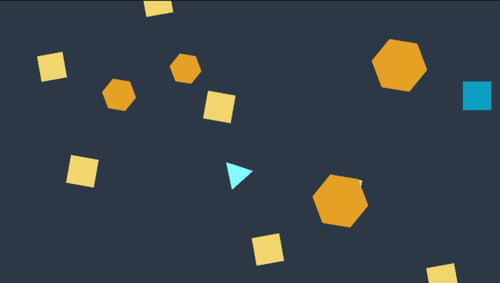

# **Exercice 1 \- Prototype simple déployé**

Un prototype d'un jeu où le vaisseau contrôlé par la joueuse peut s'évader des obstacles fixes et mobiles avec l'objectif d’arriver à une zone de finale.

Voici [le lien pour un exemple jouable](https://max-lacasse-maisonneuve.github.io/2J2-Exercices/ex1/index.html).

## **Requis**

* L'avatar (un triangle ou «vaisseau») commence à une zone de départ (le carré). Il utilise le script fourni pour la logique de détection d'entrée et le déplacement.  
* Quelques obstacles fixes (les cercles ou «planètes») sont placés au niveau.   
  * Ils doivent utiliser le script fourni pour la détection de collisions.  
* Quelques obstacles mobiles (les hexagones ou «météores») sont placés au début du jeu de façon aléatoire.   
  * Ils commencent toujours hors l’écran dans une rangée prédéterminée de l'espace du jeu.   
  * Ils ne doivent jamais bloquer les zones de départ et de finale.  
  * Ils doivent utiliser le script fourni pour la détection de collisions.  
  * Ils doivent se déplacer et croiser l'écran avec une vitesse aléatoire configurable à l’Inspector.  
  * Quand ils sortent de l’écran, ils sont téléportés au côté opposé de l’écran (mécanique de *warp*).  
* L'arrière-plan a une couleur personnalisée et différente du défaut d'Unity.  
* La caméra MainCamera doit avoir un Size de 10\.  
* L’aspect de la fenêtre Game doit être `16:9 Aspect`.  
* Le code du projet doit être hébergé sur un dépôt GitHub.  
  * Le dépôt doit être créé dans l’ organisation du cours (**26h-2j2**).  
  * Le dépôt doit être nommé **NomPrenom-Ex1**. *Ex. RossBob-Ex1.*  
* Les messages de commits sont descriptifs des changements réalisés.  
* Une version compilée (un *build*) doit être déployée sur GitHub Pages.

## **Remise**

* Date : Fin de la semaine 3 (cours 6).  
* Format : un lien pour le dépôt GitHub du projet.   
  * *Ex. https://github.com/26h-2j2/NomPrenom-Ex1.*

## **Critères**

* Le niveau a une bonne ergonomie et réalise les mécaniques décrites.  
* Les fonctionnalités de base sont stables et cohérentes.  
* Les objets mobiles se déplacent et respectent la mécanique de *warp*.  
* La variabilité aléatoire respecte les contraintes d’espace décrites.  
* La vitesse des obstacles mobiles est configurable à l’`Inspector`.  
* La présentation visuelle respecte le concept de *greyboxing*.  
* Le dépôt GitHub est dans l’organisation du cours, accessible et bien nommé.  
* Les messages de commit sont descriptifs des changements réalisés.  
* La version compilée (*build*) est fonctionnelle et stable sur GitHub Pages.