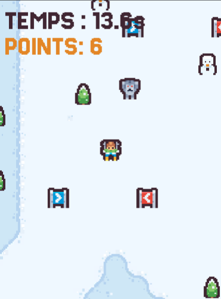

# Exercice 2 \- Prototype avec collisions

## **Synopsis du jeu**

Aux Jeux olympiques d'hiver, une nouvelle épreuve extrême fait sensation : la Descente des Cimes, où les meilleurs skieurs du monde dévalent la montagne en franchissant des portails de précision et en touchant des cibles pour accumuler des points. 

Mais au cœur du parcours, une légende devenue réalité — un Yéti surgissant de la zone centrale — force les athlètes à repousser leurs limites sous la pression du chronomètre. Entre gloire olympique et poursuite sauvage, seule une descente parfaite mènera à la médaille d’or.

## **Objectif de l'exercice**

Vous devez créer un prototype d'un jeu où un skieur descend une montagne le plus vite possible, collectant des points en passant par des portails et en touchant des objets cibles. Aussi, il faut s’évader de la terrible créature qui habite ces monts. Le mouvement du joueur doit être contrôlé par les touches WASD et les flèches. Les médias à utiliser sont seulement ceux du paquet d’assets fournis (dans le fichier **ProjetDepart.unitypackage**).

Voici le [**lien pour un exemple jouable**](https://max-lacasse-maisonneuve.github.io/2J2-Exercices/ex2/index.html).

## **Exigences requises**

### Jouabilité, ergonomie et systèmes

* L'avatar (le skieur) commence à une zone de départ en haut du niveau. Il se déplace horizontalement et verticalement mais seulement dans la direction de la descente (Il ne peut pas remonter la pente).  
* Quand le skieur arrive en bas de la montagne, une zone de détection est activée et le jeu est fini. Un message de **Victoire\!** doit être affiché sur l’écran.  
* À tout temps, l’interface graphique (UI) montre le comptage du temps et des points du jeu.  
* Une musique de fond (déjà fournie) joue et elle s’arrête quand le jeu est fini.  
* **Obstacles.** Quelques obstacles fixes et solides (des arbres, roches, etc) sont placés au niveau. Quand le skieur a une collision avec un obstacle solide, un son de collision doit jouer et il doit s'arrêter temporairement.  
* **Collection de points.** Quelques objets interactifs peuvent donner des points quand le joueur entre dans une distance minimale ou passe par une zone de détection (ex. trigger collider).   
  * Quand le skieur atteint un point, un son de récompense doit jouer.  
  * Si c’est un objet collectable, l’objet doit être désactivé de la scène.  
* **Le Yéti.** Proche du point central de la montagne, il habite un yeti.   
  * Ce monstre va poursuivre le skieur pendant qu’il est dans sa zone de détection.  
  * Si le skieur est touché par le Yéti, le jeu est fini immédiatement. Un message de **Défaite\!** est affiché.  
* Des **murs invisibles** doivent bloquer les limites du niveau pour empêcher que le skieur ne sorte.  
* Quand un message de fin de jeu est affiché (soit de victoire ou échec), le joueur peut toucher sur la barre d’espace pour recommencer le jeu après un délai de 5 secondes. Un composant pour charger la scène correctement sera fourni et vous devez l’adapter correctement.   
* La fenêtre **Game** doit avoir un aspect de **Portrait (3:4 Aspect)**. La caméra doit être orthographique avec un Size de 7\.

### Organisation du projet

* Le code du projet doit être hébergé sur un dépôt GitHub.  
  * Le dépôt doit être créé dans l’ organisation du cours (**26h-2j2**).  
  * Le dépôt doit être nommé **NomPrenom-Ex2**. *Ex. RossBob-Ex2.*  
* Les messages de commits sont descriptifs des changements réalisés.  
* Une version compilée (un *build*) doit être déployée sur GitHub Pages dans le dossier `docs` du dépôt. Le *build* doit être fonctionnel et stable.

## **Démarche suggérée**

Ces étapes sont suggérées pour vous aider à organiser le processus de travail. Si vous êtes bloqué·e sur une tâche, cherchez de l’aide ou essayez d’avancer sur une prochaine étape qui ne dépend pas d'une antérieure.

1. Mettre en ligne le dossier de départ sur un dépôt Github (faire des commits régulièrement)  
2. Placer les éléments dans la scène et ajuster la résolution et la caméra  
3. Déplacer le joueur  
4. Ajouter des colliders sur le décor, les éléments à collecter, les zones et le joueur.  
5. Gérer les collisions avec les éléments à collecter et les zones (points, sons)  
6. Gérer les collisions avec le yéti  
7. Afficher le temps et les points dans le UI  
8. Gérer la victoire et la défaite  
9. Tester et compiler  
10. Tester les liens avant la remise

## **Remise**

* Date : Fin de la semaine 6 (cours 12).  
* Vous devez remettre sur Teams :   
  * Un lien pour le dépôt GitHub du projet. Format :  *https://github.com/26h-2j2/NomPrenom-Ex2.*  
  * Un lien pour la page jouable sur GitHub Pages. Format: *https://h26-2j2-github.io/NomPrenom-Ex2.*

## **Critères**

* Fonctionnement correct du produit multimédia réalisé  
  * Les fonctionnalités demandées sont présentes et cohérentes.  
  * Le niveau a une bonne ergonomie et est jouable.  
  * La présentation visuelle et sonore utilise correctement et de façon efficace les assets fournis.  
* Utilisation adéquate des systèmes du moteur de jeu  
  * Les collisions et zones de détections sont bien configurées.  
  * Les déplacements d’objets sont fonctionnels et ergonomiques.  
  * La détection de touches est réactive et stable.  
  * Les éléments de l’interface graphique (UI) sont lisibles et fonctionnels à tout temps.  
* Organisation de projet  
  * Le dépôt GitHub est dans l’organisation du cours, accessible et bien nommé.  
  * Les messages de commit sont descriptifs des changements réalisés.  
  * La version compilée (*build*) est fonctionnelle et stable sur GitHub Pages.  
* Élaboration judicieuse des algorithmes et du code  
  * Le projet exploite efficacement les concepts d'algorithmique vus en classe (communication de GameObjects et composants, détection d’entrée, collisions, déplacements, rétroaction sonore et visuelle, interfaces graphiques simples).  
  * Le code est bien structuré et commenté.  
  * Les variables et fonctions respectent les conventions de nommage vues en classe.  
  * Les scripts fournis sont utilisés adéquatement.  
  * Le code ne contient pas de bug évident ou de code mort (code inutile en commentaire).

## Notes

Ce travail est individuel. Toute forme de plagiat entraînera la note de 0 conformément aux politiques académiques de l'institution. L'utilisation de l'intelligence artificielle pour générer du code n'est pas permise et sera considérée comme du plagiat.

Si vous utilisez du code qui n'est pas vu en classe, vous devez noter en commentaire chaque ligne en expliquant pourquoi cette ligne est plus utile et ce qu'elle remplace.

Les projets remis en retard seront pénalisés de 5% par jour calendrier selon la [**politique d’évaluation des apprentissages du département**](https://docs.google.com/document/d/1fp9bpg8S6pZNjIbRsG4Jujsgblf8JOn2yjYoxMwg__g/edit?tab=t.0).
